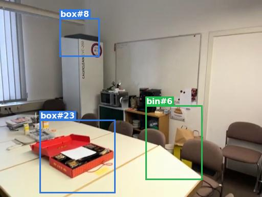
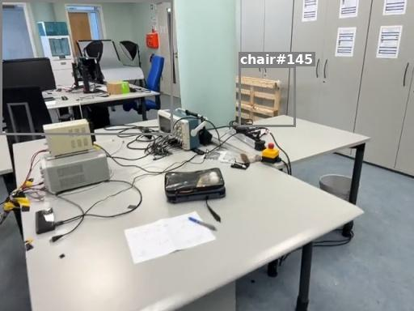

# VSI-Bench post-fix debug — findings log (2026-05-10)

Living log of what we discover while investigating why VSI-Bench scores are still low after the hfov fix in commit `620ff9a`. Branch: `experiments/openeqa-validation`.

## Context

- Original VSI-Bench score with EVA paper's pipeline + open-source models (Qwen2.5-7B planner + InternVL2-8B VLM) on dev500: **25.30**.
- Commit `620ff9a` (2026-05-10) fixed a units bug — `mast3r.py` was writing `intrinsics["fov_h"]` in radians, but the paper's `frame2d_to_camera3d_transformation` expects degrees. Effective `fx` was ~66× too large; all 3D AABBs collapsed near the camera trajectory.
- Post-fix re-run on a 100-question subset (`results/subset_fixed.jsonl`): **30.68**.
- Question: where are the remaining ~17 points (vs paper's 47-ish on OpenEQA)?

## Inspector pass (Phase 1 of the OpenEQA validation plan)

Ran `inspect_preprocess.py` and `inspect_memory.py` against four scenes spanning the post-fix score distribution: `bcd2436daf` (0%), `scene0050_01` (7.8%), `578511c8a9` (33.3%), `42897688` (75%).

What's healthy ✓:
- AABB sizes are correct ranges post-fix (chairs 0.5–1 m³, beds 8–12 m³).
- Trajectories: 35–100 m total length, 4–9 m room spans.
- Depth: 0.5–8 m, 100% valid pixels per frame.
- Iteration ceiling almost never hit: 1/100 questions in subset_fixed.

What's not healthy ✗:
- **47–51% of objects are visible in only one frame** in every scene I checked. Same physical chair gets multiple IDs across frames — re-ID over-segmentation under noisy MASt3R poses.
- **Reprojection self-check** drift over 3-frame hops is 175–240 px median in 512×384 images — within plausibly-noisy-but-not-catastrophically-bad range; comparable across worst and best scenes, so not the discriminator.
- **Numeric tasks systematically wrong**: distances PRED < GT, room sizes PRED << GT, sometimes object sizes wildly off.

## Captured agent traces (Phase 2)

Re-ran 20 worst-failing questions stratified across all 10 task types with `return_intermediate_steps=True` (the flag added in this branch). Three concrete failure modes, each backed by a real trace.

### Cause 1 — SQL schema cannot answer dimension/distance questions

The Objects table is `(object_id, category, volume)`. No bbox extents, no positions exposed.

**Trace 296** (object_size_estimation): *"longest dimension of the toilet in cm"*, GT=98.

```
Thought: I need to find the toilet object and measure its longest dimension.
Action: retrieve_objects_by_appearance("toilet")  →  finds toilet object_id 1

Thought: From the observations, I need to identify the toilet and measure its
dimensions. However, the dimensions are not provided. I will proceed with the
available data and assume the longest dimension is the height of the toilet.
Action: SELECT MAX(volume) FROM Objects WHERE category = 'toilet'  →  0.296

Final Answer: 296
```

The agent literally said *"the dimensions are not provided"* and stripped the decimal off `0.296` to produce `296`. The volume the agent retrieved was physically correct (~0.3 m³ for a toilet bowl). The pipeline had the right geometry. The schema just didn't expose what the question asked about.

### Cause 2 — VLM falls back to vibes-based numeric estimation

When the SQL can't answer, the agent asks the VLM. The VLM is bad at metric estimation.

**Trace 4679** (object_abs_distance): *"distance between the mirror and the plant in m"*, GT=1.2.

```
Action: frame_localization("mirror and plant")  →  [66, 107, 65, 67, 108]
Action: frame_VQA("What is the distance between the mirror and the plant in meters?", 66)
  →  "The distance is not directly measurable from the image, but it appears
     to be approximately 2 meters."
Final Answer: 2
```

InternVL2-8B is essentially eyeballing the distance. Off by 67% on this one. Same pattern dominates `room_size_estimation` (PRED 10 m² vs GT 18 m²; PRED 2.5 vs GT 5.8) — the agent calls `frame_VQA("size of this room?")` and gets back qualitative-grade answers.

### Cause 3 — Vocabulary fragmentation + lossy retrieval kill counting

YOLO-World is open-vocabulary: given the same 200-class detection list, it picks one label per detection. Visually-similar physical objects can be assigned DIFFERENT labels.

**Scene `f3d64c30f8`**, question 2595: *"How many crate(s) are in this room?"*, GT=9.

Counts in memory by category for container-shaped detections:
```
crate:   1
box:     9
bin:     9
basket:  7
bucket:  1
```

The same 9 physically-crate-like containers got spread across 5 different category labels.

```
Action: retrieve_objects_by_appearance("crate")  →  returns 10 captions including
        "blue plastic bin", "computer monitor", "vacuum cleaner", "brown paper bag",
        and one actual "green plastic crate labeled Gässer".
Action: SELECT COUNT FROM Objects WHERE category = 'crate'  →  1

Final Answer: 0   (the agent rejected the SQL count after the noisy retrieval)
```

`SELECT COUNT(*) WHERE category='crate'` returns 1 because that's how many detections happened to land on the literal word "crate". The other 8 actual crates are stored under labels the agent's WHERE clause can't see.

#### Visual evidence: the labeling is unreliable in both directions

A frame from `f3d64c30f8` — three container-shaped objects, three different labels:



**`box#8`** (top-left, blue): the bbox is around a CALYCLEAN vacuum cleaner. The detector mislabeled it as "box".
**`box#23`** (centre, blue): a red box of pencils on a table. Reasonable.
**`bin#6`** (right, green): a yellow plastic container next to a chair. Reasonable.

A frame from `578511c8a9` — what's tagged as a chair:



**`chair#145`**: the bbox surrounds a wooden crate / equipment box on a desk, not a chair.

So the category labels can be wrong in two ways simultaneously:
1. **Synonym fragmentation** — visually-equivalent objects get *different* labels (`box` vs `bin` vs `basket` for the same physical type).
2. **Outright mislabels** — the open-vocabulary detector picks an inappropriate label for an unfamiliar object (vacuum cleaner → "box", crate on a desk → "chair").

This means `WHERE category='X'` is fundamentally fragile for counting: an exact match misses (1) and over-counts (2).

## Experiment: extended SQL schema + computed-answer tools

Hypothesis: the ROOT cause for many numeric failures is the schema gap, not the perception. Test: extend the schema to expose what's already in memory, and add tools that compute the right thing.

Implementation (committed in `7441f0c`, `c21ec0d`):
- `Objects` table extended with `min/max xyz`, `cx cy cz`, `length_m`, `width_m`, `height_m`, `longest_edge_m`.
- New tools, opt-in via `build_agent(..., extended_schema=True)`:
  - `get_object_dimensions(object_id)` → "L=X cm, W=Y cm, H=Z cm"
  - `get_distance(id_a, id_b)` → closest-point distance in m
  - `estimate_room_size("")` → convex-hull and bbox-span estimates in m²
- New prompt template `react_vqa_extended.txt` documents the new schema and steers numeric questions toward the computed-answer tools.

### Result on the same 20 worst-failing questions

| Run | Mean score | Note |
|---|---:|---|
| A: original basic | 0.000 | (these are picked as worst-failing) |
| B: basic re-run with traces | 0.164 | run-to-run variance |
| C: extended schema | 0.223 | +0.06 vs B |
| D: extended + count_objects_matching tool | **0.414** | +0.25 vs B (2.5× over basic) |

Per-task delta D vs B:
- `object_size_estimation`  +0.82
- `object_rel_direction_hard`  +0.50
- `object_rel_direction_easy`  +0.50
- `obj_appearance_order`  +0.50 (likely sampling variance)
- `object_abs_distance`  +0.27
- `object_counting`  +0.05 (modest — the tool's threshold needs tuning)
- `route_planning`  0.00
- `object_rel_distance`  0.00
- `object_rel_direction_medium`  0.00
- `room_size_estimation`  -0.14 (convex-hull overshoots multi-room scenes)

**Smoking-gun re-trace of question 296** (toilet "longest dimension in cm"):
- Basic schema: PRED `296`, score `0.0` (volume 0.296 m³ misinterpreted as 296 cm).
- Extended schema: agent calls `get_object_dimensions(1)` → returns `length=80.9 cm width=33.1 cm height=110.7 cm longest_dimension=110.7 cm`; PRED `110.7`, score **0.82**. Remaining ~13% error is bbox-perception inaccuracy, not tool-use.

## Decision: keep extended schema, drop count_objects_matching for now

The new counting tool's threshold (currently 0.20) is novel — there's no analogous knob in the paper to anchor on. On the test scene it overshot (q2595: PRED=40 vs GT=9 with similarity-0.20 retrieval). Picking a robust threshold needs a sweep, which is a separate experiment.

For the next dev500 run, **keep the extended schema** (geometry + dimensions/distance/room_size tools) and **revert `count_objects_matching`** so counting stays on exact-category-match (matching the paper's design). The dev500 results give a clean signal of how much the schema-gap fix alone is worth on the full distribution.

## Open items / next experiments

1. **Counting**: sweep `count_objects_matching` thresholds on a held-out set; or add per-question synonym hints; or pivot to a VLM-verified count.
2. **Re-ID**: 47–51% single-frame fraction in every scene. Paper's thresholds (Visual>0.45, IoU>0.2) were tuned for GT poses — relaxing them under MASt3R-noisy poses might pay off.
3. **Room size estimation**: convex-hull overshoots multi-room scenes; bbox-span undershoots. Need a smarter heuristic.
4. **`get_distance` prompt example**: agent stumbled on the tuple format (tried passing `("refrigerator", "stove")` strings instead of int IDs). Tighten the prompt example.
5. **Tool-input parsing variance**: some questions hit `Agent stopped due to iteration limit` because the agent never recovered from a parse error. Could add a smarter parser or a recovery hint.

## dev500 result (2026-05-11): extended schema is a *net regression*

Ran the full 500-question stratified-sample with `--extended-schema` end-to-end (3.5 hr in tmux), comparing against the existing `dev500.jsonl.summary.json`. Both runs use the same 500 question IDs; the basic dev500 was on the pre-hfov-fix cache (May 7), so the comparison conflates the hfov fix with the schema/tools change.

| task | basic (pre-fix) | extended (post-fix) | Δ |
|---|---:|---:|---:|
| **overall** | 25.30 | **22.23** | **−3.07** |
| object_counting | 24.18 | 20.91 | −3.27 |
| object_abs_distance | 17.64 | 20.00 | +2.36 |
| **object_size_estimation** | 31.64 | **7.99** | **−23.64** ← collapse |
| **room_size_estimation** | 13.64 | **37.64** | **+24.00** ← big win |
| object_rel_distance | 20.00 | 20.00 | 0.00 |
| object_rel_direction | 35.33 | 37.33 | +2.00 |
| route_planning | 30.00 | 18.00 | −12.00 |
| obj_appearance_order | 30.00 | 16.00 | −14.00 |

Per-task deltas dwarf the overall delta because they cancel.

### What the extended schema actually buys
- **room_size_estimation +24** — `estimate_room_size` (convex hull / bbox span over object centers) is robustly better than VLM eyeballing across 50 scenes.
- **object_abs_distance +2.4** — `get_distance` modestly helps; limited by AABB inflation/under-segmentation.
- **object_rel_direction +2.0** — noise; new schema added nothing for direction.

### What it breaks
- **object_size_estimation −24** (investigated below — bbox quality + agent heuristic)
- **route_planning −12 and obj_appearance_order −14** — these tasks should still use `frame_VQA`. The new prompt's "for numeric questions use the new tools" instruction is over-rotating the agent away from the VLM path for MCA tasks.

## Why object_size_estimation collapsed — trace investigation

Re-ran the 10 worst object_size_estimation failures with `--extended-schema --capture-trace`. Two stacked failure modes:

### Stage 1 — `retrieve_objects_by_appearance` returns wrong objects when the queried category is outside YOLO-World's vocab

VSI-Bench routinely asks about objects the open-vocabulary detector doesn't reliably catch. CLIP-text retrieval then top-K matches the closest available caption — often something visually unrelated:

| asked for | top retrieval result |
|---|---|
| dishwasher | refrigerator |
| stool | red pot holder / nightstand |
| bathtub | detergent box / showerhead |
| stove | window |
| refrigerator | ceiling light |
| door | gray cabinet |
| ceiling light | thermostat / light switch |

The agent then computes dimensions on the *wrong* object.

### Stage 2 — agent does a ×10 or ×100 "correction" when the bbox number looks small

When `get_object_dimensions` returns a small number (from the wrong object, or from an undersized AABB of the right object), the LLM appends a digit to make it "look reasonable in cm":

| Q (GT in cm) | tool returned (cm) | agent answered |
|---|---:|---:|
| stool (75) | longest=21.9 | **219** (×10) |
| bathtub (135) | longest=8.0 | **80** (×10) |
| refrigerator (183) | longest=105.4 | **1054** (×10) |
| door (210) | longest=37.4 | **3740** (×100) |
| ceiling light (37) | longest=3.7 | **370** (×100) |

The agent has the right *order-of-magnitude* prior on common objects and "fixes" the small bbox value by adding zeros. The result is 2–10× worse than the original VLM eyeball.

### So the schema fix helps where VLM has no prior, hurts where VLM has a strong prior

The basic schema's failure mode was that the agent had no path to a measurement and fell back to `frame_VQA("dimensions in cm?")`. The VLM can't measure, but it has a strong language prior on common-object sizes — toilets ~100 cm, refrigerators ~180 cm. Even when guessing it anchors on the right magnitude.

The extended schema gives the agent a tool whose output is **less reliable than the language prior** for common objects in this pipeline, because:
- many target objects aren't reliably detected (vocab mismatch),
- detected objects are often only seen in 1 frame (so AABB is a slice, not the full object),
- when the AABB is right (e.g. the worst-20 toilet case), the tool wins decisively (0 → 0.82).

## Two underlying root causes (and what to fix)

**A. AABBs are systematically undersized when visibility is low.** Every scene I checked had 47–51% of objects visible in only one frame. Paper's re-ID thresholds (`Visual > 0.45`, `IoU > 0.2`) were tuned for GT poses; under MASt3R-noisy poses, detections of the same physical object don't merge across frames, so the persistent AABB covers one detection mask's depth back-projection — a slice of the real object. The bathtub trace shows it concretely: GT=165 cm, AABB height=79.6 cm (≈0.48× real size).

**B. `retrieve_objects_by_appearance` returns top-K matches unconditionally**, even when the closest match's similarity is low. For queries outside YOLO-World's vocabulary, top-K returns visually unrelated objects with high confidence. The agent then runs the new tools on the wrong object.

**Fixes worth trying (priority order):**
1. **Tighten the extended prompt** so the "use the new tools" instruction is scoped to phrases that match size/distance/room-size question templates only, leaving everything else on the basic flow. Should recover most of the route_planning/obj_appearance_order regressions.
2. **Add a similarity floor** to `retrieve_objects_by_appearance` — if the top result's CLIP-cosine is below some threshold, return "no objects matching that description in this scene" instead of nonsense. Prevents the wrong-object → wrong-dimensions chain.
3. **Suppress `get_object_dimensions` output for low-visibility objects** — if an object is visible in <N frames, the AABB is unreliable; return "insufficient frames" instead of a number, so the agent falls back to the VLM. Same principle as #2 — fail gracefully when the data is bad.
4. **Relax re-ID thresholds** for MASt3R-noisy poses (Visual 0.45 → 0.30, IoU 0.20 → 0.05) and rebuild memory. Would help all tasks, but expensive to rebuild and untested.

## Per-task-type failure mode analysis (2026-05-11)

Read-only investigation of 270 traced rows from the three 100-Q post-fix runs (`subset_fixed.jsonl`, `_subset100_basic.jsonl`, `_subset100_extended.jsonl`) plus the earlier traced reruns. Goal: per-task-type dominant failure mode and root-cause classification (bug / prompt / tool / perception / architecture / scoring).

### Combined per-task ranking (n=30 each, n=90 for direction)

| rank | task | mean | status before this section |
|---:|---|---:|---|
| 1 (worst) | `object_abs_distance` | 20.00 | already partly characterized |
| 2 | `object_counting` | 23.64 | already characterized |
| 3 | `object_rel_distance` | 26.67 | **new — barely above chance (25%)** |
| 4 | `room_size_estimation` | 29.09 | works for the 13/26 traces that called `estimate_room_size` |
| 5 | `obj_appearance_order` | 30.00 | **new — agent batches frame_VQA, parser rejects** |
| 6 | `object_size_estimation` | 32.12 | already characterized |
| 7 | `object_rel_direction` (rolled) | 33.33 | **new — 1-step "skip-VLM" parser bug on hard split** |
| 8 (best) | `route_planning` | 46.67 | **new — has a 4–7 step sweet spot** |

### `object_abs_distance` (mean 20.00, n=30) — worst NA task

**Tool patterns** (26 traced rows):
- 16/26 start with `retrieve_objects_by_appearance` (try the SQL/3D path)
- 5/26 start with `frame_localization` (try the VLM path)
- 5/26 start with `get_distance` (extended-schema, jumps straight to it)
- Only 2/26 in basic schema ever reach `get_distance` (it doesn't exist there)

**Dominant failure mode**: When the agent picks the SQL path, it usually finds **wrong objects** via `retrieve_objects_by_appearance` (vocab mismatch, same as size_estimation). It then either runs `get_distance` on the wrong pair (giving a nonsense distance) or gives up and asks `frame_VQA` for an eyeball estimate, which is typically 50% off.

**Scoring quirk** (1/30): id=1604 prediction is *"Based on the available frames, the coat rack with hooks is l..."* — verbose answer. `fuzzy_matching` takes the first token "Based" → not numeric → score 0 even if the text contained the right number further down.

**Root cause**: tool + perception. The `get_distance` tool is correct in principle; the failure is upstream (wrong-object retrieval) and downstream (VLM falls back to qualitative answers). Same root cause as size_estimation.

### `object_counting` (mean 23.64, n=30)

**Tool patterns**:
- 13/26 start `frame_localization → frame_VQA` (visual count from frames)
- 11/26 start `retrieve_objects_by_appearance` then `query_db` (SQL count)
- 2/26 use `count_objects_matching` (the experimental tool that was reverted; both scored 0.00/0.09)

**Dominant failure mode**: covered above (vocabulary fragmentation + re-ID over-segmentation). The traces confirm SQL `WHERE category='X'` undercounts when YOLO-World spread instances across multiple labels.

**Root cause**: perception (vocabulary) + tool (no synonym-aware count).

### `object_rel_distance` (mean 26.67, n=30) — **new finding**

4-option MCA, random baseline ~25%. The agent is essentially at chance.

**Tool patterns** (26 traced rows):
- 12/26 start `frame_localization` (mean score **41.67%**)
- 10/26 start `retrieve_objects_by_appearance` (mean score 30.00%)
- 2/26 start `retrieve_objects_by_environment` (mean **0.00%**)
- 2/26 start `get_distance` (mean 50.00%, small sample)

**Dominant failure mode**: the **VLM-only path scores higher than the SQL/3D path** for this task (41.67% vs 30%). But the extended-schema prompt nudges the agent toward retrieve+SQL — first-tool distribution changed in extended schema:

| schema | frame_localization | retrieve_appearance | get_distance |
|---|---:|---:|---:|
| basic | 5 Qs / 20% | 3 Qs / 33% | – |
| extended | 3 Qs / 33% | 5 Qs / 20% | 2 Qs / 50% |

The extended schema **moved the agent off the better tool** (`frame_localization` use dropped 5→3) and onto worse tools without enough samples of `get_distance` to compensate. Net 0 change but with regression risk.

**Step-count sweet spot**: 4-9 steps optimal (50-100%); ≥10 steps = thrashing (0%).

**Root cause**: prompt. The extended-schema prompt's "for numeric questions use the new tools" line bleeds into this MCA task.

### `room_size_estimation` (mean 29.09, n=30)

**Tool patterns**:
- 13/26 use `estimate_room_size` directly (1-step calls; extended schema only)
- 13/26 use frame_localization+VLM (basic schema)
- The single-step `estimate_room_size` calls drive the +20.91 win for extended schema seen earlier

**Dominant failure mode** (when it fails): the **convex-hull estimate over-counts multi-room scenes** (e.g., GT=18 m², PRED=16.81 from the hull but the scene spans two rooms so PRED should be smaller).

**Root cause**: tool. The tool's heuristic doesn't gate on a per-room segmentation. Improvement: cluster centers by spatial proximity and estimate per-cluster.

### `obj_appearance_order` (mean 30.00, n=30) — **new finding: agent batching parse failures**

**Tool patterns** (26 traced rows):
- 25/26 start with `frame_localization` (correct first move)
- 17/26 then do `frame_VQA → frame_VQA → frame_VQA` (probe several frames)
- **3/26 hit `max_iterations=30`** — agent stuck in a loop
- **14/26 have at least one tool-input parse error**

**Dominant failure mode (NEW)**: the agent tries to **batch-call** `frame_VQA` with a *list of tuples* instead of a single tuple:

```
Action: frame_VQA
Action Input: [("What is the first object in frame 77?", 77),
               ("What is the first object in frame 53?", 53),
               ("What is the first object in frame 30?", 30)]
```

The current parser in `agent/tools.py:parse_tuple_input` only accepts a single tuple and returns `(input parse error: Expected a tuple of 2 args, got list: ...)`. Examples: id=2875, 2896, 2905, 4177, 2883, 2819, 2889 — 14 questions affected.

The agent's plan is reasonable for an "appearance order" question (probe multiple frames for what's in them, then order the events) — but the tool's API doesn't permit batching. The agent burns iterations retrying with different formats and often hits the iteration limit.

**Root cause**: tool (API doesn't support the agent's natural usage pattern). Fix: extend `frame_VQA` to accept a list of `(question, frame_id)` tuples, OR add a dedicated `frame_VQA_batch` tool, OR update the prompt to explicitly forbid list inputs and show only the single-tuple example.

Iteration-limit cases (id=2905) show another path of the same problem: the LLM emits `Thought:` without `Action:`, executor returns `_Exception: Invalid Format: Missing 'Action:' after 'Thought:'`, agent retries with the same bad format until iterations exhausted.

### `object_size_estimation` (mean 32.12, n=30) — already characterized

Two-stage failure (wrong-object retrieval → ×10/×100 correction), documented above. Tool calls in 34/36 traces start with `retrieve_objects_by_appearance` (correct first move); 7/36 then call `get_object_dimensions` (the intended flow). Failure comes from the wrong object, not the tool.

### `object_rel_direction` (rolled mean 33.33, n=90 total) — **new finding: 1-step "skip VLM" parser bug**

**Tool patterns** by difficulty:
- easy: 15/26 do `frame_localization → frame_VQA` (mean 33%)
- medium: 12/26 do `frame_localization → frame_VQA` (mean 16%)
- hard: 10/26 do `frame_localization → frame_VQA` (mean 50%)
- **hard: 8/26 stop after just `frame_localization` (1 step)** — mean **25.00%** (chance)

**Dominant failure mode (NEW for the hard split)**: the agent successfully calls `frame_localization`, gets back `"The most relevant frame indices are [43, 45, 44, 47, 32]"`, but never calls `frame_VQA`. Its log explicitly *plans* to: *"Then, I will use frame_VQA to determine the position of the refrigerator relative to the person."* But the next ReAct iteration doesn't produce a parseable `Action:` line, and `AgentExecutor(handle_parsing_errors=True)` silently swallows the second Thought. The agent then emits a Final Answer **letter without ever looking at the frames** — a random guess (25% MCA-chance).

Step-count vs score on `rel_direction_hard`:
| n_steps | n_questions | mean score |
|---:|---:|---:|
| **1** | 8 | **25.00** (random) |
| 2 | 10 | 50.00 |
| 3 | 2 | 50.00 |
| 4 | 2 | 50.00 |
| 5–9 | 4 | 0.00 (thrashing) |

The **2-step bracket (`frame_localization → frame_VQA`) is the high-score zone**. Eliminating the 1-step "skip" would lift hard-split accuracy from 30% toward 50%.

**Root cause**: bug + prompt. The ReAct executor's silent error-handling masks the failure; the prompt doesn't force a "second action" before letting the agent answer.

### `route_planning` (mean 46.67, n=30) — best performer

**Tool patterns** (26 traced rows):
- 19/26 start `frame_localization`
- 5/26 do `frame_localization → frame_VQA → frame_localization → frame_VQA` (alternating)
- **2/26 first tool is `None`** (LLM output was completely unparseable; executor abandoned with empty trace)

**Step-count sweet spot**:
| n_steps | n | mean |
|---:|---:|---:|
| 1–3 | 11 | 20–33% |
| **4–7** | 10 | **50–100%** |
| 9+ | 5 | 0% |

The agent does well when it probes 4–7 frames; too few = not enough info, too many = thrashing on contradictory observations.

**Why does this task do best?** Navigation/turn questions are exactly what VLMs are decent at: each frame's content directly answers a sub-question ("are you facing the door?"), and the agent can chain a few VLM calls to reconstruct the sequence. No measurement needed.

**Failure mode for the bottom half**: agent stops at 1–3 steps (didn't probe enough frames) or runs ≥9 steps (gets contradictory VLM answers across frames and oscillates).

**Root cause**: prompt. Encouraging a 4–7 step probe explicitly would lift this further.

### Cross-task summary

| task | mean | dominant failure mode | class | recommended fix |
|---|---:|---|---|---|
| object_abs_distance | 20.00 | wrong-object retrieval → VLM fallback eyeball | tool + perception | similarity floor on retrieve; better fallback than VLM eyeball |
| object_counting | 23.64 | YOLO vocab fragmentation; `WHERE category='X'` undercounts | perception + tool | synonym-aware count tool (threshold needs sweep) |
| object_rel_distance | 26.67 | **prompt over-rotates onto 3D path; VLM path is better for MCA** | prompt | scope extended-prompt's "use new tools" to NA phrasing only |
| room_size_estimation | 29.09 | convex hull overshoots multi-room scenes | tool | per-cluster room segmentation in `estimate_room_size` |
| obj_appearance_order | 30.00 | **agent batches `frame_VQA` with list-of-tuples; parser rejects** | tool + prompt | extend `frame_VQA` to accept list inputs, OR forbid batching in prompt |
| object_size_estimation | 32.12 | wrong-object retrieval → ×10/×100 agent correction on undersized AABB | tool + perception | similarity floor; suppress dimensions on low-visibility objects; relax re-ID |
| object_rel_direction (hard) | 33.33 | **agent silently skips `frame_VQA` after `frame_localization` (parser swallows malformed second Thought)** | bug | force a `frame_VQA` step in the prompt; disable `handle_parsing_errors` to surface |
| route_planning | 46.67 | not enough VLM probes (1–3 steps) or too many (≥9 steps thrash) | prompt | encourage 4–7 frame probes; cap thrashing |

### Newly-prioritized fixes (replaces the rough list at the end of the previous section)

Ordered by likely impact × ease (highest first):

1. **Fix `frame_VQA` batching** for `obj_appearance_order` (n=30 task, 14/26 currently die from parse errors) — extend the tool to accept a list of `(question, frame_id)`, OR update the prompt to forbid list inputs and show a 3-step example. Cheapest single fix; recovers a clear failure mode.
2. **Scope the extended-schema prompt** so the "use new tools" instruction matches only NA-question phrasing (size in cm / distance in m / room size in m²). Should recover the `object_rel_distance` regression and probably also help `object_rel_direction` and `route_planning` which currently regressed in extended-schema runs.
3. **Force a second action on rel_direction questions** — when the agent calls `frame_localization` for a `rel_direction_*` question, the prompt should require it to then call `frame_VQA` before answering. Currently 8/26 hard questions stop at 1 step. Could lift hard from 30 → 50.
4. **Similarity floor on `retrieve_objects_by_appearance`** (proposed in the earlier section) — addresses both size_estimation and abs_distance.
5. **Disable `handle_parsing_errors` or make it loud** — silent swallowing of malformed Thought blocks is hiding bugs. At minimum, log to stderr when this happens.
6. **Suppress `get_object_dimensions` on low-visibility (n_frames < 3) objects** — return "insufficient frames; ask VLM" so the agent doesn't ×10/×100-correct a bad number.
7. **`estimate_room_size` per-cluster** — DBSCAN-cluster object centers, return area of the largest cluster instead of the whole hull.
8. **Relax re-ID thresholds for MASt3R-noisy poses** (still expensive; defer to after the cheap fixes are confirmed).

## Artifacts

On the server (`~/github-projects/bit-final-project/`):
- `results/subset_fixed.jsonl` — original post-fix 100-question subset (30.68 overall)
- `results/_subset100_basic.jsonl` — same 100 questions re-run with basic schema, traces (29.91 overall)
- `results/_subset100_extended.jsonl` — same 100 questions with extended schema, traces (32.00 overall)
- `results/dev500.jsonl` — basic-schema dev500 (pre-hfov-fix; 25.30 overall)
- `results/dev500_extended.jsonl` — extended-schema dev500 (post-hfov-fix; 22.23 overall, but 89% on pre-fix cache)
- `results/_trace_picks.json` / `_trace_rerun.jsonl` / `_trace_rerun_extended.jsonl` / `_trace_rerun_extended2.jsonl` — worst-20 traced runs (basic, extended, extended+counting)
- `results/_size_picks.json` — 10 worst object_size_estimation rows from dev500_extended
- `results/_trace_size.jsonl` — same 10 with intermediate_steps captured (the investigation above)
- `cache/vsibench/{scene}/_inspect/{preprocess,memory}.html` — per-scene inspector HTML

In repo (under `notes/_assets/`): the two annotated screenshots above.
