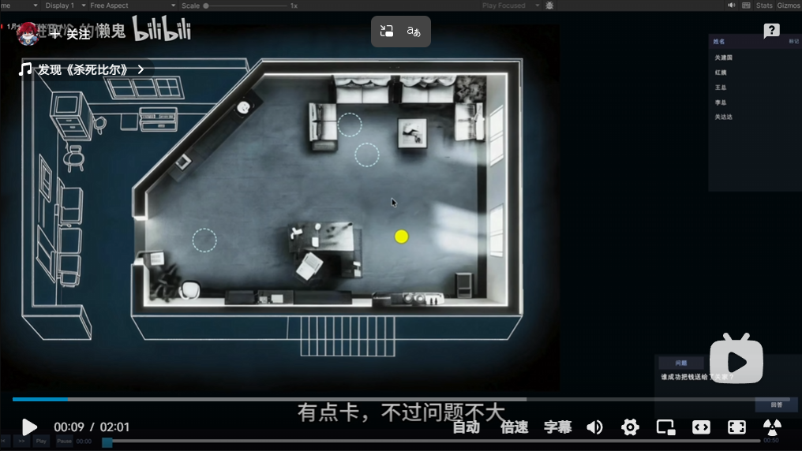
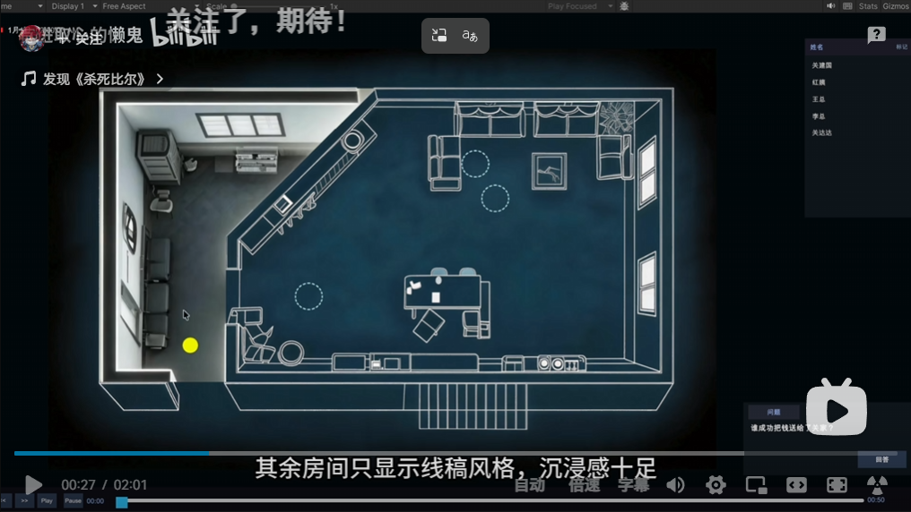

# Async reply from Diwei Su — 2026-04-29

> **Status:** **Exchange complete (2026-04-30).** Sasha's reply was sent
> as three chat messages; Su responded the same day with confirmations
> plus two illustrative images, then a follow-up where Sasha asked
> what to focus on next and Su set a concrete plan: **reproduce EVA →
> study its codebase → run on VSI-Bench → run on VSI-Super → then
> implement our own design**. See [Reply exchange](#reply-exchange-2026-04-30)
> for the full back-and-forth and key takeaways.

- **With:** Diwei Su
- **Date:** 2026-04-29
- **Format:** Async / written reply (not a live meeting)
- **Topic:** Sasha asks how LongVideoAgent ("when to look") and Embodied
  VideoAgent ("what to remember") fit into one agent; Su responds with a
  detailed elaboration of the hierarchical contextual memory design —
  panoramic scene memory + object memory + event memory, with standardized
  write / update / read operations. Sasha replies (2026-04-30) confirming
  understanding and surfacing two concerns (drift, multi-scene); Su
  confirms, reframes the panorama as a *global reference* alongside
  live video, and proposes *regional indoor scenes + predefined
  anchor points* for multi-room handling (illustrated with attached
  game-style images).
- **Related:** [notes/meetings/2026-04-26.md](2026-04-26.md),
  [notes/meetings/2026-04-17.md](2026-04-17.md)

## My message

> Good morning 苏迪威! Sorry for the late reply, needed some time to digest
> the new information you shared :)
>
> Let me try to put my current understanding together — please correct me
> if something is off.
>
> Here's a short summary:
>
> 1. Previously we discussed LongVideoAgent, which covers "when to look",
>    and several other solutions about "how to look". You suggested to look
>    into agents that help with spatial-temporal reasoning, since humans
>    reason efficiently from sparse input — thanks to memory + the ability
>    to use prior knowledge. So we want the agent to do the same instead of
>    feeding more frames to the VLM.
> 2. You also suggested to take a look at "reconstruction" approaches —
>    when the agent detects missing or sparse information, it calls a
>    generation model to reconstruct it and a reasoning model to refine.
> 3. One of the papers I found is Embodied VideoAgent, which answers the
>    question "what to remember". But the memory there is on a per-object
>    level, which is why it struggles on holistic questions like your
>    example with sofa and TV. So, extending it to scene-level memory can
>    be one of the improvements.
>
> Where I currently struggle is seeing the whole picture: how these
> existing solutions combine into one agent. My understanding is that
> frame-selection (LongVideoAgent) gives a sparse input and the structured
> memory (Embodied VideoAgent) combines those few frames into something.
> But I don't fully understand how these 2 ideas merge into one and what's
> the real purpose of the memory block.
>
> Could you please clarify these points? It looks a little fuzzy to me,
> which makes me a bit lost every time I try to put it together. The
> approaches in the papers themselves are more or less clear to me, but
> the problem is to aggregate the knowledge and apply it to our research
> direction.
>
> Many thanks!

## Transcript (Diwei Su)

> Hi Sasha!
>
> As we discussed earlier, when tackling real-world streaming video
> reasoning tasks, the exploding number of frames greatly increases the
> inference burden, and excessively long context windows also make memory
> retention extremely challenging. To address this issue, many researchers
> adopt sparse frame sampling or sliding context windows to compress input
> information, as seen in LongVideoAgent. On the other hand, to mitigate
> model forgetting under ultra-long inputs, Embodied VideoAgent designs
> object memory to store information about observed items. The former
> works at the data preprocessing stage, while the latter builds memory
> internally within the model, and the two can theoretically complement
> each other well. My idea is to advance the basic object memory of
> Embodied VideoAgent into contextual scene memory, and I would like to
> elaborate on this design in detail.
>
> First, humans mostly rely on vision to memorize the scenes we have
> experienced. It is a well-established finding that around 70 percent of
> the information humans perceive comes from vision. Accordingly, when we
> conduct daily reasoning, what we recall most intuitively is an entire
> scene. Therefore, I believe scene memory can be tightly combined with
> static object information and dynamic event information within the scene
> to form a more efficient memory mechanism.
>
> Second, the key question is how to construct such contextual memory.
> Most existing methods store scene information through textual summaries
> or formatted JSON descriptions. However, describing all details of a
> complete scene purely in text requires an enormous amount of redundant
> information. For example, recording the relative spatial relationships
> among multiple objects would demand lengthy and complex textual
> description, which is impractical. Using 3D coordinates as adopted by
> Embodied VideoAgent can alleviate this problem and performs well on
> tasks requiring precise spatial localization. Nevertheless, it
> introduces heavy computational overhead for simple reasoning scenarios
> where only rough object posture or relative position is needed. Notably,
> the human brain does not rely on such complex calculations in daily
> life, and it maintains extremely low power consumption. This inspires
> me to design a more flexible paradigm: the model only performs complex
> spatial computation when necessary, and conducts lightweight reasoning
> for simple scenarios. My solution is to construct a panoramic scene
> image to "freeze" the entire environment in one single frame. This
> approach preserves coarse-grained scene layout information. The idea is
> somewhat similar to 3D reconstruction, but avoids the massive storage
> overhead of point clouds and other 3D data representations. When objects
> or layouts in the scene change, we can update the panoramic view via
> image editing models. For ordinary scene-level reasoning, the model
> only needs to retrieve and read the stored panoramic image directly.
>
> Third, with the panoramic scene representation established, we further
> need to memorize both static and dynamic content. For static object
> information, we can reuse the coordinate-based memory design from
> Embodied VideoAgent. For dynamic events, we can record the spatial
> location of each event with coordinates and summarize the event content
> with concise textual descriptions.
>
> Fourth, based on the above design, we can build our complete memory
> system with standardized write, update, and read operations. The
> writing procedure follows the scene, object, and event memory
> construction we discussed. For memory updating, we adopt image editing
> to refresh panoramic scene memory, and follow Embodied VideoAgent's
> pipeline to update object and event memory accordingly. For memory
> retrieval, we apply RAG-style search on panoramic scene memory, while
> referencing Embodied VideoAgent's original retrieval mechanism for
> object and event memory.
>
> The core motivation for building this hierarchical contextual memory
> system is to enable the agent to process visual information efficiently.
> Since artificial intelligence is ultimately oriented toward real-world
> deployment, high efficiency is essential for it to stably and reliably
> assist humans in practical scenarios. Could you please share your
> thoughts on whether this overall memory design is feasible?

## Clarifications (self-Q&A)

Working through Su's reply in plain terms — kept here so future-me
re-reading these notes doesn't have to reconstruct the explanations.

### Q1. What is Su actually proposing, in one breath?

Take Embodied VideoAgent's per-object memory and **grow it into a 3-layer
hierarchical memory** keyed on scenes:

- **Scene** = panoramic image of the room (NEW — his bet).
- **Object** = 3D coordinates per object (kept from Embodied VideoAgent).
- **Event** = 3D coord + short text per event (new layer, but reuses
  Embodied VideoAgent's pipeline).

Each layer has standardized write / update / read ops. Panorama uses
image-editing model for updates and RAG-style search for reads; objects
and events use the existing Embodied VideoAgent pipelines.

Motivation: efficiency. The panorama lets the agent answer most
holistic-layout questions by *looking at one image* instead of running
3D math over coordinates. He says this is essential for real-world
deployment.

Diagram of the 3-layer design:
[excalidraw.com](https://excalidraw.com/#json=6bbrOyZpPIaFhOasUX9DV,IHyYqeqEBb8om0fTPs42hg)

### Q2. What does Su mean by "static object information" and "dynamic event information"?

He defines them himself in his third paragraph:

- **Static object information** = the *things* that sit in the room
  (sofa, TV, table). They don't move frame-to-frame. Stored as
  `{ID, 3D coordinate, features, ...}` — Embodied VideoAgent's
  existing schema. Answers *"what's in the room and where?"*
- **Dynamic event information** = the *things that happen* (door
  opens, cup falls, person sits). They occur at a moment in time and
  at a location. Stored as `{3D coord, short text}`. Answers
  *"what happened, where, when?"*

Crisp distinction: **nouns that exist (objects)** vs. **verbs that
happen (events)**. The panorama alone captures neither — it freezes
visual layout but doesn't enumerate objects with precise coords or
record what happened over time. So the three layers cover three
different question types.

### Q3. What does "features" mean in Embodied VideoAgent's object entry `{object_id, 3D coord, features}`?

The full schema (Appendix A; see
`literature/EmbodiedVideoAgent/analysis.md:65-72`) has six fields:
`ID`, `STATE`, `RO` (related-objects relations), `3D Bbox`, `OBJ Feat`,
`CTX Feat`. "Features" specifically = the last two: **CLIP embeddings**.

- **`OBJ Feat`** = CLIP feature of the *cropped object image*. Used
  for re-identification: "is this chair the same chair I saw earlier?"
  Match by cosine similarity.
- **`CTX Feat`** = CLIP feature of the *whole frame containing the
  object*. Used for context-conditioned retrieval: distinguishes "the
  cup in the kitchen" from "the cup at the desk" — same category,
  different surroundings.

Both are updated as a moving average — every new sighting blends into
the stored vector to stabilize over time. They are *learned visual
fingerprints*, not human-readable attributes (not "red", not "wooden").

### Q4. How does the panoramic-scene image actually work in practice?

Su keeps it abstract; concretely each operation breaks down as:

- **WRITE (build).** Sample key frames from the video → feed to a
  panorama-stitching or scene-generation model → output one image
  (probably equirectangular 360°, possibly top-down) covering the
  whole room. Stored under a scene id.
- **READ (query).** Retrieve the panorama for the relevant scene
  (RAG-style) → feed image + question into a VLM → VLM "looks at the
  picture" and answers. No 3D math, no egocentric/allocentric
  conversion — just visual inspection. *This is the efficiency win.*
- **UPDATE (patch).** When object/event memory detects a change
  (table moved, door opened), produce a text edit instruction
  ("move table to corner") and feed `panorama + instruction` into
  an image-editing model (InstructPix2Pix / FLUX-Edit style). Output
  is the patched panorama. Lower memory layers act as the trigger.

Worked example end-to-end:
[excalidraw.com](https://excalidraw.com/#json=XIbdPPrgVOPE4AX0XRnMr,JRUjDtTdLkyDni-nfJpDfw)

Su doesn't pin down: which exact format ("panorama" = 360°, top-down,
bird's-eye?), which generation model, or how change-detection feeds
into edit instructions.

### Q5. If many actions happen in the scene, does iterative image editing accumulate error?

**Yes, almost certainly — and this is the single biggest practical
risk in the proposal.** Each edit silently mutates "untouched"
regions because:

1. The latent encode/decode round-trip is lossy (textures resample,
   edges blur, fine detail vanishes).
2. The model interprets each instruction with some ambiguity ("which
   corner?"); guesses compound across many edits.
3. No explicit 3D / lighting / scale model — perspective and shadows
   diverge from physical plausibility.
4. Identity drift on unedited objects (sofa subtly recolors, TV
   shrinks, phantom plants appear).

After ~20 sequential edits even a state-of-the-art editor will
produce visibly degraded scenes. This is the documented "iterative
degradation" / "model collapse" failure mode.

**Mitigations Su's design needs but doesn't specify:**

- **Periodic full re-stitch** from original frames + current object
  positions (use edits as fast path; reset every N updates).
- **Anchor edits to live video** — when something changes, condition
  the edit on the latest frames of that area, not just text.
- **Mask-only inpainting** — bound damage to the affected region.
- **Edit log + lazy materialization** — keep base panorama frozen,
  store edits as a structured log, replay on demand (event-sourcing
  for images).
- **Drift detection** — periodically compare panorama to live frame;
  rebuild if divergence too high.

**Architectural escape hatch:** the object memory holds *ground
truth* (precise 3D bboxes from depth sensors). The panorama is a
*derived cached view* for fast/cheap reads. When the panorama
drifts, regenerate it from the object/event memory. Reframes the
problem from "broken" to "needs a refresh policy."

### Q6. What happens when a video has multiple scenes (several rooms, or outdoors)?

Su's proposal as stated assumes one scene per panorama and never
addresses what counts as a scene boundary or how scenes relate.

**Multi-room indoor (natural extension):** scene memory becomes a
gallery `{scene_id → panorama}`. But this introduces three new
sub-problems Su doesn't mention:

1. **Scene boundary detection.** What signal triggers "this is a new
   scene"? CLIP embedding jump, doorway crossing, large pose delta?
2. **Scene re-identification.** When the camera comes back to a room,
   recognize it instead of duplicating the panorama.
3. **Inter-scene topology.** "Which room is behind me?" can have
   *another room* as the answer, which requires a **scene graph**:
   `living_room ──(door_1)── kitchen`. This looks like a fourth
   memory layer the proposal doesn't include.

**Outdoors (the panorama metaphor breaks down):** continuous
unbounded space has no walls to give natural discretization. A 360°
panorama at one spot doesn't capture a 1-km walk. Possible
discretizations (grid cells, landmark-anchored, keyframe-based,
trajectory-as-sequence) all trade redundancy against coverage gaps.
Outdoors the design likely needs to lean on object/event memory
more heavily, with panoramas as sparse/per-landmark snapshots
rather than the always-on primary representation.

**Indoor ↔ outdoor transitions** add a scene-type classifier
requirement (VLM call: "indoor or outdoor?") and need a unified
topology that crosses the type boundary.

**Same scene, different state over time** (lighting, time of day,
major rearrangement) is hard to express as a sequence of edits —
beyond the per-edit drift, may need full re-stitch.

### Q7. How does dynamic event memory actually work?

An *event* = an action/happening at a moment (door opens, person
sits, cup falls). Stored as
`{coord, text, timestamp, related_objects}`.

**WRITE pipeline** (reuses Embodied VideoAgent's existing action
machinery, every ~2 seconds):

1. **Action detection** with LaViLa → verbose text (`"#C C catches
   the can"`).
2. **Object association** — VLM (GPT-4o) sees the frame with object
   3D bboxes overlaid as numbered boxes, picks the box being acted
   on (e.g. `box_3` → `cup_3`).
3. **Coord** = `cup_3`'s 3D bbox center, pulled from object memory.
4. **Text summary** = condensed description (`"cup picked up"`).
5. **Append** the entry to event memory.
6. **Side effect** = `cup_3.STATE` updates `normal → in-hand` in
   object memory.

**READ patterns**: semantic (text similarity over descriptions);
spatial (distance from query coord); temporal (timestamp range);
combined ("what happened near the kitchen at 2:30?").

**Why both coord AND text:** coord enables spatial queries; text
enables semantic queries; together you can ask the combined form.

**Connection to other layers:** events are the trigger for
panorama updates (`fridge door opens` → `edit panorama: open the
fridge door`). Events also reference object memory via
`related_objects` so a single event lookup can cross-reference the
full object schema (3D bbox, features, current state).

**What Su doesn't pin down:** whether event memory is a redundant
log (object STATE changes derivable from it) or independent
storage; and no aggregation/compaction policy for when many
micro-events should be summarized into macro-events.

### Q8. How do Write and Read operations work across all three layers?

**WRITE — by layer:**

- **Scene panorama** *(new piece):* triggered on scene boundary;
  sparse key frame selection (LongVideoAgent-style); stitch /
  scene-gen model produces one image; indexed with a CLIP
  embedding for later retrieval.
- **Object memory** *(unchanged from Embodied VideoAgent,
  Algorithm 3):* every frame — YOLO-World detection → SAM-2 mask →
  depth lift to 3D bbox → CLIP `OBJ Feat` + `CTX Feat` (DINOv2
  for re-ID only, not stored) → re-identify → merge or insert →
  recompute `RO` relations.
- **Event memory:** every ~2s — LaViLa action detection → VLM
  object association → coord lookup → text summary → append entry
  → propagate STATE update to object memory.

**READ — by layer:**

- **Scene panorama:** RAG-style. Embed query (CLIP text encoder) →
  cosine similarity vs stored panorama embeddings → retrieve top-K
  → feed image+query to VLM → VLM "looks at the picture" and
  answers. *This is the efficiency win.*
- **Object memory** (Embodied VideoAgent's `query_db`): by
  category, visual similarity (`OBJ Feat`), context (`CTX Feat`),
  relation (`RO`), state, or temporal location.
- **Event memory:** semantic / spatial / temporal / combined
  filters as described in Q7.

**Cross-layer queries** are where the design earns its keep — most
realistic questions hit multiple layers:

- *"What's in the kitchen?"* → scene + object
- *"Which room is behind me?"* → scene only (the win — pure
  panorama read replaces 3D math)
- *"Where is the milk?"* → object (location/state) + event (last
  interaction) + scene (panorama of that room)

A VLM at the top fuses results from the layers it consulted.

**What Su doesn't pin down:** what RAG actually indexes over
panoramas (image embeddings? captions? both?); cross-layer query
orchestration (LLM-agent dispatcher? hard-coded planner?);
read-time freshness checks before returning a possibly-stale
panorama.

### Q9. Why do we need RAG-style search on panoramic scene memory?

Because as soon as you have more than one scene, you need a way to
pick the right panorama at query time. After deployment, scene
memory is a *bank*:

```
scene_memory = {
   "living_room": v3.png,
   "kitchen":     v2.png,
   "bedroom":     v1.png,
   "hallway":     v1.png,
   "garage":      v1.png,
}
```

Real queries rarely name the scene by ID ("where did I leave my
keys?" doesn't say "kitchen"). You need fuzzy matching from query
→ panorama.

**Why RAG specifically (vs. hard-coded routing):**

- Cross-modal for free: CLIP embeds text and images into the same
  space, so a text query can retrieve an image.
- No hard-coded rules: works for paraphrases, partial descriptions,
  arbitrary natural-language queries.
- Scales linearly with the number of stored panoramas.
- Already battle-tested — Embodied VideoAgent uses the same idea
  for object retrieval.

**When RAG is *not* needed:** single-scene videos; live queries
about the current scene the agent is already in; queries that
explicitly name a scene id.

**Where RAG is brittle:** compositional queries ("room with both a
sofa AND a piano") don't decompose cleanly in embedding space;
fine-grained discrimination (two bedrooms) may not separate; OOD
queries drop in retrieval quality. Usually solvable by combining
RAG with an LLM reranker or adding scene-level captions as
additional retrieval keys — Su doesn't say which augmentations he
has in mind.

### Q10. Do we store changes in memory when many actions happen?

**Yes, but only in event memory.** The other two layers throw the
past away:

| Layer | When something changes | Past state |
|---|---|---|
| Scene panorama | Image-edit in place (v1 → v2) | v1 overwritten, gone |
| Object memory | STATE flipped, 3D Bbox moving-averaged, features blended | Old values lost |
| Event memory | Append a new `{coord, text, timestamp}` | All entries kept forever |

**Standard current-state + change-log split.** Object/scene
memory hold *current state*; event memory holds *change history*.

**Can answer** (purely from event log): "when was the door last
opened?"; "what happened in the kitchen between 2:00 and 3:00?";
"how many times has the cup been touched?"

**Cannot answer** without extra machinery: "what did the kitchen
look like yesterday?" (no panorama snapshot); "where exactly was
the table before it moved?" (3D bbox averaged out); "show me the
room before the renovation" (no version history).

**Two unscalable things at long-deployment scale:**

1. **Event memory grows linearly with time.** No aggregation /
   compaction policy means hundreds of micro-events accumulate per
   hour. When does "person opened drawer + picked spoon + put down
   spoon + ..." get summarized as "person made coffee"?
2. **Panorama drift is irreversible** — no snapshot history means
   you can't recover an earlier visual state.

**Strong observation for the reply:** *periodic panorama snapshots*
would simultaneously enable visual time-travel queries *and* solve
the drift problem from Q5. Two motivations for the same fix → strong
case to add it as an explicit mechanism.

## Key points

- **Two complementary mechanisms.** Su's framing: LongVideoAgent =
  data-preprocessing-stage compression (sparse frames); Embodied
  VideoAgent = inside-the-model memory (object bank). The panorama
  proposal sits inside the second, as a generalization upward from
  per-object → scene-level.
- **The bet is the panoramic image.** Object memory stays as is; event
  memory is largely a recombination of the existing pipeline. The
  novel piece — and the load-bearing one — is the panorama as primary
  scene representation.
- **Why panorama over text or 3D coords.** Su explicitly compares: text
  is too verbose for spatial relations; 3D coords are precise but
  computationally heavy for simple "what's the layout?" queries. The
  panorama is the cheap-default option, with object coords as the
  precise fallback when needed.
- **Hierarchy = self-healing.** Object/event memory holds ground truth;
  panorama is a derived cached view. This is also the answer to drift:
  panorama can always be regenerated from the lower layers. Su doesn't
  state this explicitly but it follows from the design.
- **Standardized W/U/R is reused machinery.** Object and event use
  Embodied VideoAgent's existing pipelines unchanged. Only the scene
  layer needs new tooling (image stitching, image editing, RAG over
  images).

## How this connects to earlier discussions

- Direct continuation of [2026-04-26](2026-04-26.md), where Su first
  raised "scene-level memory on top of Embodied VideoAgent" as a
  research bet. That note already framed the *what* (scene-level vs
  object-level memory). This reply gives the *how* (panorama as the
  scene representation, plus W/U/R operations).
- Builds on the "memory mechanisms are key" thread from
  [2026-04-17](2026-04-17.md). Su's hippocampus / efficient-memory
  emphasis turns into a concrete data structure here.
- The "detect → reconstruct → refine" loop from 2026-04-17 maps onto
  the update mechanism: object/event memory detects the change,
  image-editing model reconstructs the panorama, the resulting
  scene is re-readable for refined retrieval.

## My open questions / things to flag in the reply

These are the load-bearing implementation details Su has not
specified. The reply should sharpen them into specific questions
rather than reject the proposal:

1. **Panorama format.** Equirectangular 360°? Top-down? Bird's-eye
   composite? Each has different strengths for occlusion/viewpoint.
2. **Source of truth vs cache.** Is the panorama the source of truth
   or a cached view derived from object/event memory? This determines
   the refresh policy and how drift is recovered.
3. **Edit grounding.** Are edits driven blindly by text, or grounded
   against current video frames of the affected region? Without
   grounding, drift is much faster.
4. **Drift / refresh policy.** After how many edits do we re-stitch
   from scratch? What detects degradation?
5. **Scene boundary detection.** What signal marks "a new scene
   begins" — embedding jump, doorway crossing, pose delta?
6. **Scene re-identification.** When the camera returns to a room,
   how do we match it to an existing panorama instead of duplicating?
7. **Multi-scene topology.** Is a `scene_graph` layer (rooms +
   doorways) implicit in the design or missing? "Which room is
   behind me?" needs it.
8. **Outdoor / unbounded space.** Does panorama remain primary
   storage outdoors, or does the design fall back on object/event
   memory? The panorama metaphor doesn't naturally apply to
   continuous environments.
9. **Edit precision.** Current image editors handle semantic edits
   ("add a plant") well but are weak at precise geometric moves
   ("0.3 m left"). Implications for how often edits are usable.
10. **Occlusion in 2D.** A panorama can't represent what's behind a
    wall. The "kitchen behind the sofa" example only works if the
    doorway is *visible in the panorama*; otherwise it falls back to
    object memory or generative completion.
11. **Event log redundancy.** Are object STATE changes derivable
    from the event log, or are they stored independently? If
    derivable, the design is leaner; if not, there's duplication.
12. **Event aggregation / compaction.** Event memory grows linearly
    with deployment time. When do micro-events get summarized into
    macro-events ("person opened drawer + picked spoon + ..." →
    "person made coffee")?
13. **What RAG indexes over panoramas.** CLIP image embeddings?
    Scene captions? Both? Retrieval quality depends entirely on
    this choice; Su says "RAG-style search" but not what's indexed.
14. **Cross-layer query orchestration.** Who decides which layers
    to consult for a given query — an LLM-as-orchestrator agent,
    a hard-coded query planner, the VLM itself? Not specified.
15. **Read-time freshness.** Is there a check before returning a
    panorama / object STATE that may be stale (drifted, or not yet
    updated since the last action)?
16. **Panorama snapshots.** *Strong proposal for the reply:*
    periodic panorama snapshots would simultaneously enable
    visual time-travel queries ("what did this room look like
    yesterday?") *and* solve the drift problem (Q5). Two
    motivations for one fix — argue for adding it as a first-class
    mechanism.
17. **Compositional / fine-grained RAG queries.** "The room with
    both a sofa AND a piano" doesn't decompose well in CLIP space;
    two visually similar rooms may not separate. Probably needs
    an LLM reranker or scene-level captions as additional keys.

## Reply exchange (2026-04-30)

Sent as three chat-style messages over the same thread, with the
write/update flow diagram attached to the first one.

### My reply (sent)

> Hi! Thank you for the detailed explanation. Let me share my
> understanding to check I got it right, and then I have a couple of
> questions.
>
> **My understanding (simplified):**
>
> We take the video, then select sparse key frames, and construct a
> panoramic image of the scene. Besides that, we also keep an object
> memory similar to Embodied VideoAgent's. When an event happens
> (e.g. the table moves to the corner), we use RAG-style search to
> retrieve the relevant panorama, then call an image-editing model
> to update it.
>
> In memory we store:
>
> - **Objects**: `{object_id, 3D coordinates, features}`
> - **Events**: `{spatial location, event summary}` — e.g. *"the door
>   opened at 2:34"*
>
> An example diagram is attached.
>
> If my understanding is correct, I have a few questions.
>
> First: it seems that if a video has many events (actions), then the
> image-editing model might accumulate errors. Each edit will change
> "untouched" pixels — and after many sequential edits the panorama
> could drift far from reality. Is this a concern for the design?
>
> Second: what happens if one video has several scenes — for example,
> several rooms, or it's outdoor? For multiple rooms I imagine it can
> be stored as a gallery, but how to detect the scene boundaries is
> an open question.
>
> Actually, RAG search is for retrieval to answer questions, right?

Diagram attached: [write/update flow on excalidraw.com](https://excalidraw.com/#json=XIbdPPrgVOPE4AX0XRnMr,JRUjDtTdLkyDni-nfJpDfw)

### Su's response

> Yes, your understanding is correct.
>
> 1. Yes, every step of the operation inevitably introduces
>    cumulative errors, so how to strengthen consistency across the
>    whole pipeline will be an important part of our subsequent
>    design. That said, the panoramic scene mainly serves as a
>    *global reference*; the model still needs to answer questions
>    based on the *real-time video stream itself*.
>
> 2. Besides, the memory design for indoor and outdoor scenarios
>    should be fundamentally different. Therefore, I think it is
>    more reasonable for us to start our attempt with indoor scenes.
>    The memory construction of indoor environments is somewhat
>    similar to the visual text adventure games we used to play.
>    We can divide a whole indoor space into multiple regional
>    scenes, and establish connections between different scenes
>    through *predefined anchor points*.
>
> Yes, RAG is for memory retrieval. Given memory + current video
> stream, let the model answer the question.

Su attached two illustrations of the "regional scenes + anchor
points" idea — top-down adventure-game-style views of a multi-room
indoor space:





### Key takeaways from Su's response

- **Drift acknowledged + reframed.** Su accepts cumulative error is
  real and labels "consistency across the pipeline" as a
  *subsequent design problem*. The reframe matters more than the
  acknowledgement: **the panorama is a *global reference*, not the
  source of truth — the model answers from memory + the *real-time
  video stream*.** Memory is one input, live video is another. This
  significantly weakens the urgency of the drift problem and
  changes how reads work — it is no longer "VLM looks only at the
  panorama"; it is "VLM looks at panorama *and* current video."
- **Indoor-only scope confirmed.** Outdoor environments need
  fundamentally different memory and are deferred. Start indoor.
  This resolves open question #8 (defer, don't solve now).
- **Multi-scene topology answered: regional scenes + predefined
  anchor points.** Indoor multi-room handled by treating each
  region as its own scene memory and linking regions via
  predefined anchor points. Direct analogy to text-adventure-game
  navigation (rooms = nodes, doorways = edges). The two attached
  images illustrate this. **This resolves open question #7** (the
  scene-graph layer is real and intentional, not missing).
- **RAG clarification confirmed.** RAG is for retrieval (answering
  questions), not for triggering panorama updates. The agent uses
  *memory + current video stream* together to answer. This is a
  more important architectural fact than it first appears — see
  next bullet.
- **The READ flow changes.** Earlier in these notes we framed READ
  as *"retrieve panorama → VLM looks at the picture and answers"*.
  Su's clarification corrects this: it is *"retrieve relevant
  memory (panorama, object entries, events) + current video stream
  → VLM answers using both"*. Memory is an *aid* to perception of
  the live stream, not a replacement for it.

### Follow-up (2026-04-30) — concrete next-step direction

Same thread, immediately after Su's response above.

> **Me:** Cool, now it's much clearer, thank you!
>
> Quick question on what to focus on next: should I continue
> researching panorama-generation approaches, or would it be better
> to focus first on reproducing results from Embodied VideoAgent?
> Or anything else?
>
> **Su:** I suggest you first reproduce the full pipeline of Embodied
> VideoAgent and thoroughly study its codebase. After that, you can
> test it on standard video benchmarks like VSI-Bench and streaming
> video understanding tasks such as VSI-Super. Once you finish these
> steps, we will have a solid experimental foundation to build upon.
> Then we can start implementing our own design and ideas.

**Concrete plan from Su (in order):**

1. Reproduce the full Embodied VideoAgent pipeline.
2. Thoroughly study its codebase.
3. Test on **VSI-Bench** — the benchmark from the original *Thinking
   in Space* paper, evaluation infra already in
   `literature/thinking-in-space/code/`.
4. Test on **VSI-Super** — the streaming video understanding extension.
5. *Then* implement our own design on top of this experimental
   foundation.

**What this resolves:**

- Settles the "lit-survey vs reproduce" question — **reproduce first**.
- Pins the benchmarks: VSI-Bench + VSI-Super. No need to scout for
  multi-scene benchmarks (open question #6 in the earlier list)
  until the foundation is in place.
- **Panorama-generation research is explicitly *deferred*** — focus
  is on building the experimental foundation, not designing the new
  layer yet.
- Confirms the canonical critical-path arc: *understand the existing
  system → measure where it falls short → design improvements
  against measured gaps*. This is the same arc Su flagged in
  [2026-04-17](2026-04-17.md) (re-read it: "the next step will be
  to reproduce the baseline, learn basic agent architecture design,
  and meanwhile investigate whether similar approaches have already
  been explored").

### Open questions — resolution status after this exchange

| # | Question | Status |
|---|---|---|
| 1 | Panorama format | Still open |
| 2 | Source of truth vs cache | **Resolved** — panorama is a global reference; live video is the answer source |
| 3 | Edit grounding against live video | Still open (relevant to the "consistency" subsequent-design problem) |
| 4 | Drift / refresh policy | **Acknowledged as subsequent-design problem** — not solved, but explicitly on the roadmap |
| 5 | Scene boundary detection | Still open |
| 6 | Scene re-identification | Still open |
| 7 | Multi-scene topology | **Resolved** — regional scenes + predefined anchor points |
| 8 | Outdoor / unbounded space | **Deferred** — start with indoor |
| 9 | Edit precision | Still open |
| 10 | Occlusion in 2D | Still open |
| 11 | Event log redundancy | Still open |
| 12 | Event compaction / aggregation | Still open |
| 13 | What RAG indexes over panoramas | Still open |
| 14 | Cross-layer query orchestration | **Partially clarified** — VLM uses memory + live video together |
| 15 | Read-time freshness | **Less critical** — live video provides freshness anyway |
| 16 | Panorama snapshots | Still open (would still help with consistency) |
| 17 | Compositional / fine-grained RAG | Still open |

## Next steps (per Su's 2026-04-30 directive)

In order, not in parallel:

- [ ] **Reproduce the full Embodied VideoAgent pipeline.** Set up
      the environment from the upstream codebase (or
      `literature/EmbodiedVideoAgent/code/` if cloned); get the
      complete pipeline running end-to-end on a sample input.
      Perception stack: YOLO-World + SAM-2 + CLIP/DINOv2 + LaViLa +
      a VLM (GPT-4o or InternVL2-8B per the paper).
- [ ] **Thoroughly study the codebase.** Read through Algorithms
      1-3 (re-ID + memory construction), the VLM-based memory
      update logic (Section 3.3), and `query_db` retrieval. Take
      notes for future reference and to inform the eventual design.
- [ ] **Run on VSI-Bench.** The benchmark from the original
      *Thinking in Space* paper. Evaluation harness already lives
      in `literature/thinking-in-space/code/` (see project root
      `CLAUDE.md` for the run commands). Should integrate cleanly
      with the EVA pipeline since both are video-Q&A.
- [ ] **Run on VSI-Super.** Streaming video understanding — the
      setting where EVA's persistent memory should pay off the
      most. Confirm the benchmark exists / is accessible and
      adapt the eval harness if needed.
- [ ] **(After steps above)** Resume the design discussion with Su
      with measured numbers in hand — design improvements against
      measured gaps rather than speculative ones.

**Deferred until the experimental foundation is in place** (these
are still real but not now):

- Panorama-generation model survey.
- Indoor scene-graph + "predefined anchor points" literature
  (3D Scene Graph, ConceptGraphs, Habitat-Matterport, SAVVY,
  Feature4X, LIRA).
- Image-editing model drift survey.
- Consistency / anti-drift mechanism design (Su's "subsequent
  design problem").

**Mental model to keep in mind throughout:** memory + live video →
answer (not memory → answer). The panorama is a *global reference*,
not the source of truth — relevant for evaluating both EVA's
existing design and any future extension.
